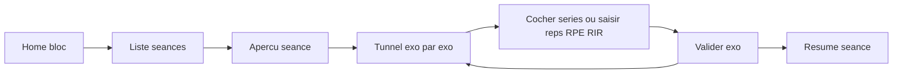

# App Workouts — Expo + Web (Netlify)

## Stack

- **Expo 53 + expo-router + TypeScript + react-native-web** (même base que `tilawa-mobile`)
- **Zustand + AsyncStorage** pour l’état et la persistance locale des validations
- **Déploiement web Netlify** (`expo export -p web` + config Netlify SPA) pour ouvrir l’URL sur téléphone sans dépendre du tunnel Expo/Wi‑Fi local

## Design

- Palette soft : fond beige très clair (`#F7F1EA`), accents rose (`#E8A0B0` / `#D4788C`), texte brun doux
- Typo expressive (ex. **Fraunces** display + **DM Sans** UI via `@expo-google-fonts`)
- UI aérée, peu de cards ; focus sur le tunnel séance (un exo à la fois, gros boutons de validation)

## Modèle de données

Fichier source unique de prog : [`data/programming.ts`](data/programming.ts)

```ts
// Concepts clés
Block { id, name, weeks: 4, sessions: Session[] }
Session { id, name, order, exercises: Exercise[] }
Exercise {
  id, name, format: 'sets_reps' | 'pyramid' | 'emom' | 'amrap' | 'for_time' | 'max_reps' | 'negatives' | 'complex'
  // progression par semaine
  prescriptionByWeek: WeekPrescription[] // index 0 = semaine 1
  band?: 'bleu' | 'vert' | 'jaune' | null
  notes?: string
  // reps/sets/poids/RPE/RIR/1RM selon le format ; champs absents = UI laisse vide / saisie libre
}
```

Élastiques codés : bleu=5, vert=15, jaune=25 (affichés clairement dans l’UI).

## Ta programmation (bloc 4 semaines)

Encodée telle quelle dans `data/programming.ts` :

- **Séance 1** — Tractions pyramide 1→7 ; EMOM 10 min élastique bleu reps **2/3/4/5** ; élévations latérales (reps vides) ; crunch poulie haute (reps vides)
- **Séance 2** — Dips **2×3** poids **2,5/5/7,5/10** ; **2×6** **bleu/0/2,5/5** ; chest press ; développé militaire haltères ; rota int. épaules (reps vides où non précisé)
- **Séance 3** — Tractions négatives lestées **10/12,5/15/20** ; squat **1×1** **70/75/80/85** + **3×3** **55/60/65/70** ; fentes bulgares ; presse ; hip thrust ; oiseau deltoïde post. (reps vides)
- **Séance 4** — MU anneaux excentrique **3×1** (v+b) ; négatives **3×1** **5/7,5/10/12,5** ; complexe ×4 : 10 pull-up bleu / 10 dips bleu / 10 squat 30 kg / 10 pompes ; leg raises (reps vides)

Progression bloc : la semaine courante sélectionne automatiquement la prescription de la semaine N.

## Parcours utilisateur (espace coaché)



Écrans (expo-router) :

- [`app/(athlete)/index.tsx`](<app/(athlete)/index.tsx>) — bloc courant, semaine active (1–4), 4 séances
- [`app/(athlete)/session/[id].tsx`](<app/(athlete)/session/[id].tsx>) — aperçu + bouton « Commencer »
- [`app/(athlete)/session/[id]/run.tsx`](<app/(athlete)/session/[id]/run.tsx>) — **tunnel** : 1 exo, barre de progression, cocher séries / saisir reps-poids-RPE-RIR selon format, Valider → suivant
- [`app/(athlete)/history.tsx`](<app/(athlete)/history.tsx>) — séances terminées (AsyncStorage)
- [`app/(coach)/index.tsx`](<app/(coach)/index.tsx>) — placeholder « bientôt » (pas de logique coach pour l’instant)
- Sélecteur rôle minimal au lancement (défaut = coaché)

## Tunnel & formats

Composants dédiés dans [`components/workout/`](components/workout/) :

- `SetsRepsLogger` — cocher chaque série ; champs poids / reps si vides ou libres
- `PyramidLogger` — tractions 1→7 (cocher chaque niveau)
- `EmomLogger` — timer 10 min + cible de reps de la semaine + validation minutes
- `ComplexLogger` — rounds × mouvements (séance 4)
- Champs optionnels **RPE / RIR / 1RM estimé** sur les mouvements clés (squat, dips, tractions, MU)

Chaque validation écrit dans le store + AsyncStorage immédiatement.

## Netlify / test téléphone

- Script `web:export` → `expo export -p web`
- [`netlify.toml`](netlify.toml) : publish `dist`, redirect SPA `/* → /index.html`
- Guide court dans le README : build + drag&drop Netlify ou CLI

## Hors scope (volontairement)

- Auth, sync cloud, espace coach éditable
- Calcul auto 1RM avancé / graphs longs (prévoir champ 1RM simple seulement)
- Notifications / timers EMOM très poussés au-delà d’un countdown propre
